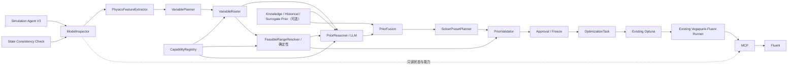

# Pre-Simulation Intelligence：架构与 Schema 草案（修订版）

状态：Phase 1–6 已实现；Phase 7 离线流程及 Phase 7R 的受控真实闭环已有审计产物。2026-09-26 补充 P0 完整实验审批与统一 V3/Frozen Prior 启动门禁，见 [完整执行审批](Fluent_Execution_Approval_P0.md)。本文下方 Phase 表保留原实施计划，不再表示当前待开始状态。本文件不是 Fluent 运行结果；Phase 8 正式 Campaign 尚未在本轮执行。

2026-09-27：P1/P2 代码与离线回归已补充，见 [证据与运行一致性改造](Fluent_Agent_P1_P2.md)。当前有效规则优先于本文保留的原计划：V1 尚无已验证的变量—目标趋势，不能把速度/Reynolds 等测量事实当作范围缩小依据；推荐域保持可行域，高潜力域为 null。新报告仅输出最佳观测点、独立复算状态及已评估跨度，不生成最优区域；复算成功不等于设计改进已验证。

## 1. 模块关系与权限边界



图中的业务主链顺序固定。`State Consistency Check` 是进入每次规划前的前置门禁；`FeasibleRangeResolver` 是 `VariableRouter` 之后、`PriorReasoner` 之前的确定性侧路，不改变主链节点顺序。`PriorReasoner` 仅输出非执行性的 `PriorProposal`；融合、校验、人工批准、冻结之后才可编译成 `OptimizationTask`。现有 Optuna、Runner、MCP、Fluent 是执行链，不在 Pre-Simulation 阶段运行。

Pre-Simulation 的硬约束：**NO SOLVE / NO ITERATE / NO INITIALIZE / NO BC MUTATION / NO SOLVER SETTING MUTATION**。读取失败不能改用“短暂写入再恢复”的探测方式；只能标记 `UNKNOWN` / `UNVERIFIED`，必要时阻止下游冻结。尤其现有入口方向探针有临时写入行为，不能作为本阶段只读检查使用。

## 2. Schema 定义草案

以下是语义 Schema，字段名与必填性拟在 Phase 1 固化为版本化类型。区间均为闭区间；计算前须归一单位，保留原值和来源。`confidence` 为 `[0, 1]` 的校准程度描述，**不能替代证据或审批**。

```python
EvidenceStatus = Literal["SUPPORTED", "PARTIAL", "INSUFFICIENT"]
VerificationStatus = Literal["VERIFIED", "UNVERIFIED", "UNKNOWN"]
VariableRouteKind = Literal["DIRECT", "MAPPED", "GEOMETRY"]

Range = {"lower": float, "upper": float, "unit": str}  # lower <= upper
EvidenceRef = {
    "source_type": str,       # model_readback/user/registry/knowledge/history/surrogate
    "source_id": str,
    "fact": str,
    "profile_version": str | None,
    "verification": VerificationStatus,
}
UserIntent = {
    "intent_id": str, "target": str, "objective": dict,
    "hard_bounds": dict[str, Range], "constraints": list[dict],
    "source_text": str,
}
ModelProfile = {
    "case_fingerprint": str,  # Case 文件/会话关键状态的受控标识
    "profile_version": str,   # 单调递增或内容寻址；不可原地覆盖
    "generated_at": str,      # ISO-8601，含时区
    "dependency_versions": dict[str, str],  # scanner/schema/registry/Fluent/插件等
    "state_digest": dict[str, str],  # mesh、zone、models、materials、catalog 等
    "readbacks": dict, "verification": VerificationStatus,
}
PhysicsFeatures = {
    "profile_version": str,
    "features": dict[str, {"value": object | None, "unit": str | None,
                           "evidence": list[EvidenceRef],
                           "verification": VerificationStatus}],
}
CandidateVariable = {
    "variable": str, "user_rationale": str,
    "unit": str, "route_candidate": VariableRouteKind,
}
VariableRoute = {
    "variable": str, "kind": VariableRouteKind,
    "parameter_ids": list[str], "mapping_id": str | None,
    "capability_status": VerificationStatus, "evidence": list[EvidenceRef],
}
ParameterFeasibleRange = {
    "variable": str, "feasible_range": Range,
    "constraint_sources": list[EvidenceRef],
    "mapping_preimage_rule": str | None,
    "verification": VerificationStatus,
}
PriorProposal = {
    "variable": str,
    "route": VariableRouteKind, "current_value": float | None, "unit": str,
    "feasible_range": Range,  # 确定性解析结果的只读副本，汇总时再与权威值核对
    "recommended_range": Range,
    "high_potential_range": Range | None,
    "confidence": float,
    "evidence_status": EvidenceStatus,
    "evidence": list[EvidenceRef],
    "assumptions": list[str],
    "missing_information": list[str],
    "reasoning_summary": str,
    "profile_version": str,
}
SolverPreset = {
    "preset_id": str, "profile_version": str,
    "iteration_policy": IterationPolicy,  # min_iterations/initial_budget/hard_limit/check_interval/early_stop_enabled/convergence_window
    "convergence_policy": dict,  # monitors/thresholds/window/early_stop 等
    "confidence": float,
    "preset_basis": list[EvidenceRef],
    "assumptions": list[str],
    "evidence_status": EvidenceStatus,
    "verification": VerificationStatus,
}
OptimizationPrior = {
    "profile_version": str,
    "ranges": list[{
        "variable": str,
        "feasible_range": Range,
        "recommended_range": Range,
        "high_potential_range": Range | None,
        "evidence_status": EvidenceStatus,
        "sources": list[EvidenceRef],
    }],
    "fusion_policy_version": str,
}
PriorValidation = {
    "valid": bool, "errors": list[str], "warnings": list[str],
    "profile_version": str, "validator_version": str,
}
OptimizationTask = {
    "approved_prior_id": str, "profile_version": str,
    "case_fingerprint": str, "approval_id": str,
    "search_space": list[dict], "solver_preset": SolverPreset,
    "runner_contract_version": str,
}
ObservedOptimalRegion = {
    "variable": str, "region": Range,
    "completed_trial_ids": list[str], "objective_definition": dict,
    "method": str, "generated_at": str,
}  # 仅正式仿真后生成，不属于 Pre-Simulation 输出
```

`feasible_range` 只由 `FeasibleRangeResolver` 产生：将用户硬边界、CapabilityRegistry 边界、Fluent 参数边界、工程安全边界、物理有效性边界按归一单位取交集。对于映射变量，要用已注册映射的逆像计算语义变量可行域，并校验关联原生参数的联合约束；不可由 LLM 自由扩张。空交集、未知必需边界、未注册映射或几何能力未核实，均不得冻结任务。用户设置的起始值可在搜索域外，但须独立提示，不得默默改写硬边界。

Phase 1 契约澄清：`PriorProposal.feasible_range` 是给 Schema 做本地包含关系校验的副本，不是 LLM 新生成的边界。汇总成 `OptimizationPrior` 时必须与 `ParameterFeasibleRange` 的权威值逐变量完全一致；不一致即拒绝。

区间不变量：`high_potential_range ⊆ recommended_range ⊆ feasible_range`；若证据不足，允许 `recommended_range == feasible_range` 且 `high_potential_range == null`。禁止 `guaranteed_optimal_range` 之类字段或“仿真前真实最优”的表述；`observed_optimal_region` 必须引用实际完成的 Trial。

## 3. PriorReasoner 接口

```python
class PriorReasoningRequest:
    user_intent: UserIntent
    model_profile: ModelProfile
    physics_features: PhysicsFeatures
    candidate_variables: list[CandidateVariable]
    variable_routes: list[VariableRoute]
    capability_registry: dict
    feasible_ranges: list[ParameterFeasibleRange]
    knowledge_prior: dict | None
    historical_prior: dict | None
    surrogate_prior: dict | None

class PriorReasoner(Protocol):
    async def propose(
        self, request: PriorReasoningRequest
    ) -> list[PriorProposal]: ...
```

要求：通过项目受控的 LLM 运行时调用，结构化输出；输入只含当前有效 `profile_version` 的事实和来源，外部先验缺席时显式为 `None`。模型不拥有 Fluent/MCP 写操作工具，也不生成命令、脚本、边界条件更改或 Solver 设置更改。它可以说明假设和缺失信息，但不把缺失的关键物理量填成猜测值。输出即使 JSON 合法也只是“提案”，不能绕过 `PriorFusion`、`PriorValidator` 和 `Approval / Freeze`。

`PriorFusion` 应按来源可靠性、适用 Case/工况、历史 Trial 的有效性合并提案及可选先验；冲突保留并降级证据状态，不能通过平均互相矛盾的区间制造虚假精度。第一版若无经过验证的 Knowledge/Historical/Surrogate 来源，显式记录缺席，不暗示已使用。

## 4. PriorProposal 示例

以下仅展示“100 W 散热器入口角”这一类需求在关键热阻与流动证据缺失时的**示意响应**，不是当前 Case 的已验证计算结论。`[-30°, 30°]` 假定来自用户硬边界且已通过确定性范围求交；若实际边界/映射未核验，不得按此示例创建任务。

```json
{
  "variable": "inlet_angle",
  "feasible_range": {"lower": -30, "upper": 30, "unit": "deg"},
  "recommended_range": {"lower": -30, "upper": 30, "unit": "deg"},
  "high_potential_range": null,
  "confidence": 0.25,
  "evidence_status": "INSUFFICIENT",
  "evidence": [
    {"source_type": "user", "source_id": "angle-hard-bound", "fact": "用户给定 [-30°, 30°] 硬边界", "profile_version": null, "verification": "VERIFIED"}
  ],
  "assumptions": ["示例假定角度映射已经注册；执行前仍需只读核验当前 Case 的可用性"],
  "missing_information": [
    "当前 Case 的入口方向参数及注册映射的只读核验",
    "足以判断流动与换热趋势的可追溯物理特征"
  ],
  "reasoning_summary": "现有证据不足以合理收窄范围，保留完整可行域；不主张高潜力区间。",
  "profile_version": "illustrative-only"
}
```

该示例中的 `confidence` 仅为 Schema 演示，不应被解释为实际概率。真实结果必须由实际只读状态和证据生成。

## 5. EvidenceStatus、刷新与校验逻辑

| 状态 | 判定 | 允许的范围结果 | 下游动作 |
| --- | --- | --- | --- |
| `SUPPORTED` | 关键特征、变量路由、范围约束及趋势依据均有可追溯、适用且已核验证据 | 可谨慎收窄推荐范围；高潜力范围仍必须有专门依据 | 进入融合与校验；不代表自动批准 |
| `PARTIAL` | 有部分可靠证据，但有未覆盖或不确定的趋势/工况 | 推荐范围可保守收窄；高潜力范围仅在其证据独立充分时给出，否则 `null` | 列出缺口与假设；由校验器判定是否可审批 |
| `INSUFFICIENT` | 缺少关键物理数据、来源冲突不可消解或关键事实无法只读确认 | 推荐范围退回完整可行域，高潜力范围为 `null` | 明确缺失信息；若可行域/执行能力未核验则阻止冻结 |

证据状态描述**物理推断质量**；`UNKNOWN` / `UNVERIFIED` 描述**状态或能力核验结果**，二者不可混用。`PriorValidator` 至少检查：Schema/单位/有限数值；所有区间包含关系；可行域来源和映射逆像；引用的 profile 版本一致且当前；EvidenceStatus 与 evidence、missing_information 一致；CapabilityRegistry/VariableRoute 足以执行；SolverPreset 的预算、收敛监测与依据一致；Pre-Simulation 无副作用；任务审批及冻结时 Case 指纹再次匹配。任何校验失败都不能导出 `OptimizationTask`。数值 `confidence` 再高也不能豁免。

每次进入规划先执行轻量 `State Consistency Check`：对当前 Case 身份、文件/会话指纹及关键结构摘要作只读比对。未变化则复用同一有效 `ModelProfile`；仅非结构性局部状态变化且可定位依赖时执行 `Partial Refresh` 并生成新版本，同时只重算受影响特征/提案；**加载新 Case、Geometry/Mesh、Zone topology、Physical Model、Materials、Parameter catalog 改变或 Case fingerprint 不一致**时，旧 Profile 失效，执行 `Full Re-Introspection`。不能只以 Case 文件 hash 判断活动 Fluent 会话状态。若关键状态无法只读确认，标记 `UNKNOWN` / `UNVERIFIED`，不能冒险复用旧 Profile 或通过写入式探针确认。刷新必须单写者、原子发布；所有 Agent 节点共享同一有效 `profile_version`。失效时连带撤销基于旧版本的提案、预设、校验及未执行冻结对象；运行中的 Trial 按既有执行契约单独处理，不被悄悄改 Case。

`SolverPresetPlanner` 只能提出预算/收敛策略，不得在 Pre-Simulation 应用设置。每个预算、阈值、窗口与 early-stop 决定需在 `preset_basis` / `assumptions` 中可解释；监测量不可读或 Runner 不支持分段检查时，标记未核验并采用明确的保守固定上限策略或阻止启用相应提前停止能力。不得假定现有 Runner 已有通用动态提前停止。

## 6. Phase 1–7 实施计划（用户确认后开始）

| 阶段 | 交付与门禁 |
| --- | --- |
| Phase 1：Schema 与契约 | 固化上述版本化 Schema、序列化/迁移、配置边界、区间/单位/证据的静态验证；测试缺失字段、非法区间、旧版本拒绝。无 Fluent 写操作。 |
| Phase 2：只读 ModelInspector 与 Profile 刷新 | 接入轻量 State Consistency Check、版本化缓存、Partial Refresh、结构变化 Full Re-Introspection；禁用写入式探针；测试相同 Case 复用、局部变更、七类结构失效及 UNKNOWN。 |
| Phase 3：PhysicsFeatureExtractor / VariablePlanner / VariableRouter / FeasibleRangeResolver | 可追溯特征与候选变量；DIRECT/MAPPED/GEOMETRY 路由；确定性约束交集、单位换算、映射逆像；测试空交集、未知边界、不可执行路由。 |
| Phase 4：PriorReasoner 与 PriorFusion | 接入受控 LLM 的纯提案接口、结构化输出、来源冲突和可选先验缺席语义；测试无工具调用、缺证据降级、越界提案留给校验器拒绝。 |
| Phase 5：SolverPresetPlanner / PriorValidator / Approval-Freeze | 生成有依据的预算与收敛提案；完整不变量、版本、能力和无副作用校验；审批时复核 Case 指纹并冻结不可变计划。测试过期/冲突/未核验不能发布。 |
| Phase 6：现有 Optuna 与 Runner 的薄集成 | 从已批准任务编译搜索域与 solver preset，复用现有 Optuna/Runner/MCP/Fluent；仅在现有执行契约明确支持时启用分段收敛/提前停止，否则维持固定预算并声明限制。测试旧流程回归和冻结任务可重放。 |
| Phase 7：端到端验证与观测 | 先离线/模拟验证，再对用户授权 Case 做只读规划；单独批准后跑真实 Trial 和复算。审计 LLM 调用、Profile 版本、证据、范围收缩、无效 Trial 比例与计算成本。P1 修订：当前输出 `best_observed_parameter` / `evaluated_parameter_span`，不生成 `observed_optimal_region`，不把样本跨度或仿真前先验称为最优。 |

各 Phase 的入口与退出以测试和审计记录为准。P0 后，旧 prior-only 冻结文件仍可读取审计，但必须重新进行完整实验审批后才允许编译执行；不得自动补签或覆盖旧审批。
